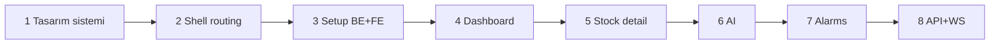

# ARGOS Frontend — Uygulama Planı

> Durum: **Onay bekliyor** — bu planda kod yok; onay sonrası adım adım uygulanacak.
> Referans: `design/` (TEK GERÇEK KAYNAK)

---

## 0. Mevcut durum

| Bileşen | Durum |
|---------|--------|
| `design/*` | HTML+JSX prototip, `styles.css`, 2 tasarım doc |
| `backend/` | FastAPI çalışıyor; **setup endpoint'leri yok** |
| `frontend/` | Henüz yok |

Backend portföyü `backend/data/portfolio.json` (MRVL, AVAV, NVDA). Prototip mock'u 6 hisse (MRVL, NVDA, TSLA, AAPL, AMD, PLTR) — API bağlanınca backend verisi esas alınacak.

---

## 1. Hedef monorepo yapısı

```
argos/
├── design/                 # Referans only (mevcut)
├── backend/                # FastAPI (mevcut + setup routes eklenecek)
├── frontend/               # YENİ — Vite + React 18 + TS
│   ├── index.html
│   ├── vite.config.ts      # proxy /api → :8000, /ws → ws://:8000
│   ├── package.json
│   └── src/
│       ├── main.tsx
│       ├── App.tsx           # setup gate + router outlet
│       ├── tokens.css        # :root + light override (styles.css satır 6–74)
│       ├── global.css        # styles.css geri kalanı (shell, card, setup, anim)
│       ├── theme/
│       │   ├── ThemeProvider.tsx
│       │   └── useTweaks.ts  # prototip TWEAK_DEFAULTS (opsiyonel TweaksPanel)
│       ├── components/
│       │   ├── layout/ Sidebar Header MarketPill
│       │   ├── ui/ Card Badge RangeBar Sparkline Button Input ...
│       │   ├── charts/ PriceChart RsiGauge MacdMini
│       │   └── setup/ SetupWizard SetupProgress Step1–3 SecretField ...
│       ├── features/
│       │   ├── dashboard/
│       │   ├── stock/
│       │   ├── ai/
│       │   └── alarms/
│       ├── pages/            # route → feature wrapper
│       ├── store/            # zustand: portfolio, market, ui
│       ├── lib/              # format.ts, indicators.ts (data.jsx'ten port)
│       ├── services/         # api.ts, ws.ts, setupApi.ts
│       └── fixtures/         # data.jsx → TypeScript mock (geçiş)
├── docs/
└── ai/context/frontend.md
```

**Neden `frontend/` kökü?** Backend ile ayrım net; CI/Makefile genişletmesi kolay.

---

## 2. Teknoloji kararları

| Alan | Seçim | Gerekçe |
|------|--------|---------|
| Build | Vite 5 + TS strict | Hızlı HMR |
| Router | react-router-dom v6 | Prototip route mantığı |
| State | Zustand | Hafif; portföy + canlı fiyat |
| Stil | Global CSS + CSS Modules (bileşen-özel) | `styles.css` birebir; shadcn yok (prototip uyumu) |
| Animasyon | framer-motion (setup + sayfa geçişi) | `ARGOS-setup-wizard.md` |
| Grafik | **lightweight-charts** | Candlestick + volume; canvas prototipine yakın |
| Sparkline | SVG (mevcut `Sparkline` port) | `charts.jsx` |
| Font | Inter + JetBrains Mono (Google Fonts) | Tasarım doc |
| HTTP | fetch + `services/api.ts` | Basit; axios şart değil |

---

## 3. Tasarım sistemi (Adım 1)

1. `styles.css` → böl:
   - `tokens.css`: `:root` + `:root[data-theme="light"]` + `--t-accent` tweakables
   - `global.css`: reset, shell, header, card, badge, setup, animasyonlar, utilities (glow-pos, skeleton, …)
2. `ThemeProvider`: `document.documentElement.setAttribute("data-theme", theme)` + localStorage `argos.theme`
3. Tipografi: `.mono` sınıfı; fiyat alanlarında zorunlu `font-family: var(--font-mono)`
4. **Kabul:** DevTools'ta token değerleri `design/styles.css` ile hex bazında aynı

---

## 4. Shell + routing (Adım 2)

**Route haritası** (prototip `app.jsx` ile uyumlu):

| Path | Ekran |
|------|--------|
| `/` | redirect `/dashboard` |
| `/dashboard` | Dashboard |
| `/stock/:symbol` | Hisse Detay |
| `/ai` | AI Analiz |
| `/alarms` | Alarmlar |
| `/settings` | Ayarlar + "Kurulum sihirbazını yeniden çalıştır" |

**Bileşenler:** `Sidebar` (64px, nav, WS pulse), `Header` (başlık, MarketPill, portföy özeti), `main.page` scroll.

**Kabul:** Sidebar aktif çizgi, MarketPill açık/kapalı, tema toggle — prototip ekran görüntüsü ile yan yana.

---

## 5. Backend setup + Wizard (Adım 3)

### 5a. Backend (önce — uçtan uca test)

Yeni: `backend/api/routes/setup.py` + `main.py` include.

| Endpoint | Davranış |
|----------|----------|
| `GET /api/setup/status` | `.setup_complete` flag, `has_env`, `has_portfolio` |
| `POST /api/setup/env` | `backend/.env` yaz (gitignore) |
| `POST /api/setup/portfolio` | `portfolio.json`; stop/hedef **otomatik** (ATR veya % kuralı — basit: avg_cost×0.92 / ×1.15) |
| `POST /api/setup/complete` | `backend/data/.setup_complete` |

`.gitignore`: `.setup_complete`, `backend/.env` (zaten var).

### 5b. Frontend wizard

`ARGOS-setup-wizard.md` ağacı: `SetupWizard`, `SetupProgress`, `Step1ApiKeys`, `Step2Portfolio`, `Step3Complete`.

- Mount: `GET /api/setup/status` → `setup_complete === false` ise tüm app yerine wizard
- Validasyon: dokümandaki regex'ler (`setup.jsx` → `V` objesi port)
- framer-motion: adım slide, liste enter/exit
- **Kabul:** 3 adım tamamlanınca dashboard; sayfa yenilemede wizard gelmez

---

## 6. Dashboard (Adım 4)

- `HeroCard` ×3: Toplam Değer, Bugünkü P&L, Nakit — glow sınıfları
- `StockCard` grid 3 kolon: sparkline, range bar (ok/warn/danger), sinyal badge, RSI
- Veri: önce `fixtures/stocks.ts`; sonra `GET /api/portfolio` + `/api/prices/all`
- Kart tık → `/stock/:symbol`

**Kabul:** Hover `translateY(-2px)`, range bar renk eşikleri (>10% / 5–10% / <5%)

---

## 7. Hisse Detay (Adım 5)

- Layout 65/35
- Sol: fiyat başlığı, range chips (1G…1Y), mum/alan toggle, overlay toggles, `PriceChart` (lightweight-charts)
- Sağ: `SignalCard`, `PositionCard` (stop/hedef düzenle → `PUT /api/portfolio/position/{symbol}`), `NewsCard` (5 haber, başlık only)

API: `/api/technical/{symbol}`, `/api/technical/{symbol}/signal`, `/api/news/{symbol}`

---

## 8. AI Analiz (Adım 6)

- 55/45 layout; chat + rapor listesi
- `POST /api/analysis/chat`, sabah/kapanış mock raporlar → ileride scheduler log veya ayrı endpoint
- Typing indicator, hızlı butonlar (prototip)

---

## 9. Alarmlar (Adım 7)

- Tablo + timeline + sticky `NewAlarmForm`
- API: `GET/POST/DELETE /api/alerts`, `GET /api/alerts/log`

---

## 10. Entegrasyon & cilalama (Adım 8)

| Kaynak | Hedef |
|--------|--------|
| `fixtures/*` | Kademeli kaldır |
| `GET /api/portfolio` | Zustand portfolio store |
| `WS /ws/prices` | Header + kart flash animasyonu |
| CORS | Zaten `localhost:3000` — Vite port 5173 için backend CORS güncelle |

**Makefile:** `make dev` → backend + frontend paralel (opsiyonel).

---

## 11. Uygulama sırası (onay sonrası)



Her adım: tek PR veya tek commit bloğu; **"prototiple karşılaştır"** checklist.

---

## 12. Riskler

| Risk | Mitigasyon |
|------|------------|
| Prototip 6 hisse vs backend 3 | API verisi öncelikli |
| lightweight-charts + BB/EMA | Custom series overlay |
| Setup `.env` runtime reload | Dokümanda "sunucu yeniden başlat" notu |
| CORS 5173 | `main.py` allow_origins genişlet |

---

## 13. Onay sonrası ilk komut (örnek)

> Adım 1: `frontend/` Vite projesi oluştur, `tokens.css` + `global.css`'i `design/styles.css`'ten böl, ThemeProvider ekle. Kod yaz, prototiple karşılaştırma notu üret.

---

*Plan dosyası: onay için. `design/CURSOR-PROMPT.md` günlük Cursor prompt'u için.*
